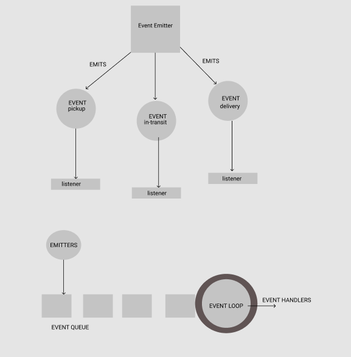
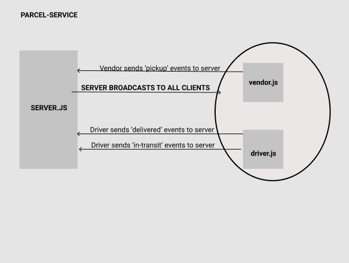

# parcel-service
An event-driven application that uses built-in Node.js events to simulate realtime package delivery, networked events using TCP Creation , socket.io implementation, and queue logic

**Author: Riva Davidowski**

**Collaboration/Credits: Thank you to [Bryant Davis](https://github.com/BryantDavis1986) for assisting me with Phase 3 refactor**

### Phase 1:

In this first phase, I setup a system of events and handlers, with the intent being to change out the eventing system as I go, but keeping the handlers themselves largely the same. The task of “delivering a package” doesn’t change (the handler), even if the mechanism for triggering that task (the event) does.

### Phase 2: 

In Phase 2, I spread the functionality of the application into multiple applications, so that users on different computers and connections can continue to communicate in real time as packages are prepared, picked up, and delivered.

The core functionality I've built remains the same. The difference in this phase is I use multiple applications to raise and listen for the events. Here the major difference in how I deal with the events.

### Phase 3:

Phase 3 involves replacing TCP with socket.io. Socket.io allows for cleaner event handling
and provides web connectivity. Socket.io manages the connection pool, makes broadcasting much easier to operate, and works well both on the terminal (between servers) and with web clients.

The core functionality of this app still remains the same but the difference in this phase is the refactoring of the networking layer.

### Phase 4: 

This phase involves adding a layer of complexity to the application. Rather than just “fire” events and hope that our vendors and drivers respond to them, I implement “queue” system so that nothing gets lost. Every event sent will be logged and held onto by the server until the intended recipient acknowledges that they received the message. At any time, a subscriber can get all of the messages they might have missed.

This phase requres building out the queue itself, getting our vendors subscribed to it, and focusing on just one event - delivered to set the pattern for subscribing to, and working with queues.

### Installing:
- You need to have Node and npm (node package manager) installed. If you do not have these, head over to Node setup to install node on your local system. Confirm that node and npm are installed by running the following commands in your terminal.
    
    `node --version`

    `npm --version`

- `npm i @code-fellows supergoose`
- `npm i faker` for faking data
- `npm i dotenv` for holding store name so I can easily pass it around
- load the `net` module: `const net = require('net`):
- Install Express and Socket.IO. To install these and save them to package.json file, enter the following command in your terminal, into the project directory.

`npm i socket.io  express --save`

- Install the socket.io client:
  
`npm i @types/socket.io-client` for `vendor.js and driver.js`

  
### dotenv Requirements:

- In `caps.js` and `driver.js`:
  
  `PORT=`

- In `vendor.js`:
  
  `PORT=`

  `STORE_NAME=`

## Using parcel-service:

- **For the first phase:** running Node.js in the console and an understanding of the `EventEmitter` class was needed. You can read more about EventEmitter [here](https://nodejs.org/api/events.html#events_asynchronous_vs_synchronous). I created an instance of the EventEmitter class rather than using it alone so that I wouldn't have to create a separate event emitter object to emit events.
- To start the program, run `node caps.js`
  
- **For the second phase:** 
  
You will have server.js, driver.js and vendor.js all running in the console in separate tabs. This way, you can keep track of the events. Implementation of TCP server starts by creating the server object. By calling `.createServer` on the net module, our server object is created. After this make it listen on a port , printing the server address once the server is listening.
- Declare connection listener function, Log when a client connnects and listen for data from the connected client. Log the data from the client
  
- **For the third phase:**
  
You will still need to have server.js, driver.js and vendor.js connected. Implmentation of socket.io takes place by using the require syntax to create a server and open up socket connections. Loading the module socket io take place `const io = require('socket.io'). Creating a namespace for vendors and drivers to connect to is the first step after server creation. 

- **For the fourth phase:**
  
Bring in Express! The API server handles incoming requests from drivers when a package has been delivered. This simulates the driver scanning a package as they deliver it to a customer.
The  `POST` route to the API is used to achieve this. The Queue Server Hub( server.js) is alerted by the API server when a delivery has been made. It also keeps a log of the delivery, keyed by retailer and event type and broadcasts “Delivery Confirmations” to retailers.

When a client receives a message, it talks to the hub server know that it was received and the hub server should then delete the message. The client can ask for all undelivered messages from the server.

## UML:

;

